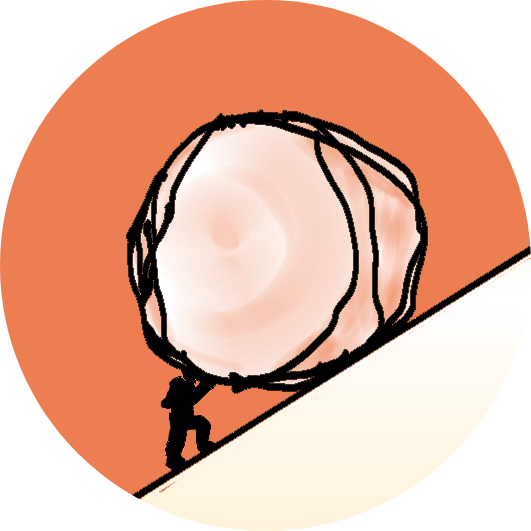

# avacio.github.io
The personal branding and website of Alexis Gervacio! 
[Click here to go to the live page](https://avacio.github.io/)

## Logo

In July 2025, I was laid off from a job and team that I really loved. At first I was optimistic and full of hope, thinking that it would be a good time to change things up anyways. As days of job applications and upskilling turned into weeks of job applications and upskilling, I found myself sometimes struggling for motivation. In these times, after recharging with friends and nature, I was reminded of the Story of Sisyphus. Doomed to push a rock up a mountain, only for it to roll back down each time he neared the top. An eternal toil. Despite these circumstances, as Albert Camus said, "one must imagine Sisyphus happy". Meaning that even in the face of a seemingly absurd and eternally repetitive task, one can obtain happiness by choosing to accept fate and find meaning in the present moment. Happiness is a choice, albeit not an easy one. I'm really trying to embrace this motto as I continue my journey.

  
My signature colour is **#ec7e51**: an orange which I think encapsulates warmth, energy, playfulness.

## Name
I suppose the name **"avacio"** may seem nonsensical at first, but when I was scrounging my brain for any possible cool and funny and relevant usernames, my friend just laid it down, clean and simple.  
**A**~~LEXIS~~ ~~GER~~**VACIO**  
I think it's sweet and simple. :)

  
## Opening Animation
For the animation, I pulled out the old tablet and stylus to draw a representation of me pushing the rock up the mountain as per the Story of Sisyphus.

After exporting the layers and frames from ibisPaint, I put it together on Canva.

## Attributions
- Mountain Range picture background in footer:
  - Transparent Background PNGs by Vecteezy: https://www.vecteezy.com/vector-art/6552247-mountain-silhouette-mountain-ridge-mountain-background

  

_____

# Getting Started with Create React App

This project was bootstrapped with [Create React App](https://github.com/facebook/create-react-app).

## Available Scripts

In the project directory, you can run:

### `npm start`

Runs the app in the development mode.\
Open [http://localhost:3000](http://localhost:3000) to view it in your browser.

The page will reload when you make changes.\
You may also see any lint errors in the console.

### `npm test`

Launches the test runner in the interactive watch mode.\
See the section about [running tests](https://facebook.github.io/create-react-app/docs/running-tests) for more information.

### `npm run build`

Builds the app for production to the `build` folder.\
It correctly bundles React in production mode and optimizes the build for the best performance.

The build is minified and the filenames include the hashes.\
Your app is ready to be deployed!

See the section about [deployment](https://facebook.github.io/create-react-app/docs/deployment) for more information.

### `npm run eject`

**Note: this is a one-way operation. Once you `eject`, you can't go back!**

If you aren't satisfied with the build tool and configuration choices, you can `eject` at any time. This command will remove the single build dependency from your project.

Instead, it will copy all the configuration files and the transitive dependencies (webpack, Babel, ESLint, etc) right into your project so you have full control over them. All of the commands except `eject` will still work, but they will point to the copied scripts so you can tweak them. At this point you're on your own.

You don't have to ever use `eject`. The curated feature set is suitable for small and middle deployments, and you shouldn't feel obligated to use this feature. However we understand that this tool wouldn't be useful if you couldn't customize it when you are ready for it.

## Learn More

You can learn more in the [Create React App documentation](https://facebook.github.io/create-react-app/docs/getting-started).

To learn React, check out the [React documentation](https://reactjs.org/).

### Code Splitting

This section has moved here: [https://facebook.github.io/create-react-app/docs/code-splitting](https://facebook.github.io/create-react-app/docs/code-splitting)

### Analyzing the Bundle Size

This section has moved here: [https://facebook.github.io/create-react-app/docs/analyzing-the-bundle-size](https://facebook.github.io/create-react-app/docs/analyzing-the-bundle-size)

### Making a Progressive Web App

This section has moved here: [https://facebook.github.io/create-react-app/docs/making-a-progressive-web-app](https://facebook.github.io/create-react-app/docs/making-a-progressive-web-app)

### Advanced Configuration

This section has moved here: [https://facebook.github.io/create-react-app/docs/advanced-configuration](https://facebook.github.io/create-react-app/docs/advanced-configuration)

### Deployment

This section has moved here: [https://facebook.github.io/create-react-app/docs/deployment](https://facebook.github.io/create-react-app/docs/deployment)

### `npm run build` fails to minify

This section has moved here: [https://facebook.github.io/create-react-app/docs/troubleshooting#npm-run-build-fails-to-minify](https://facebook.github.io/create-react-app/docs/troubleshooting#npm-run-build-fails-to-minify)
